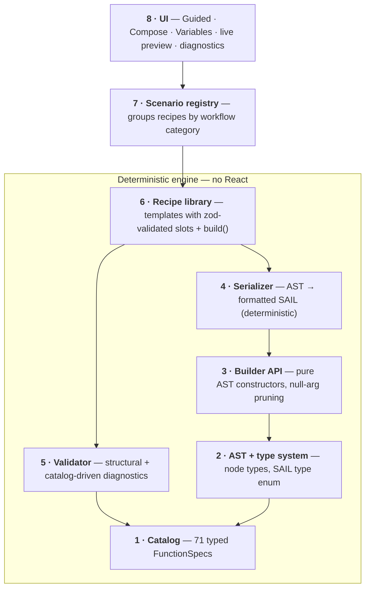

<div align="center">

# SAIL Formula Generator

**Generate valid Appian SAIL expressions from guided forms and composable templates — with zero AI at runtime.**

[](https://github.com/creativeskyai/SAIL-Formula-Generator/actions/workflows/ci.yml)
[](LICENSE)
[](#stack)
[](#testing--verification)
[](#why-it-works-without-ai)

**[What it is](#what-it-is) · [Why no AI](#why-it-works-without-ai) · [The three modes](#the-three-modes) · [How it works](#how-it-works) · [Quickstart](#quickstart) · [Testing](#testing--verification) · [Scope](#scope--honesty)**

</div>

---

## What it is

A standalone, fully deterministic, offline, client-only web app that turns a scenario choice plus filled-in slots into correct, well-formatted SAIL. **Same inputs → byte-identical output, always.** No backend, no network calls, deployable as static files anywhere.

> [!NOTE]
> All the "intelligence" lives in three data/logic layers — a function **catalog**, a **recipe** (template) library, and a **composition engine** — not in a model. The tool guarantees *syntactic* well-formedness and catalog conformance; it does not infer novel logic at runtime.

## Why it works without AI

SAIL is a functional language: every construct — components, layouts, queries, logic — is a documented function call with a known parameter list, types, and defaults (`a!textField(label:, value:, saveInto:, ...)`). There is no imperative control flow to infer. The language maps cleanly onto three things a compiler front-end already knows how to handle:

- an **AST** (function calls, literals, arrays, maps, variable refs, operators),
- a **catalog** (each function = a schema of typed params), and
- a **serializer** (AST → formatted SAIL string).

Because the target is structured and finite per function, a form-driven builder plus template composition covers the real workflow space deterministically. This is a compiler problem, not an ML problem.

## The three modes

| Mode | What you do | Backed by |
|------|-------------|-----------|
| **Guided** | Pick a scenario, fill a dynamic form, watch valid formatted SAIL generate live with deterministic validation, then copy or export. Nested and list slots render as add/remove sub-forms. | Recipes + serializer + validator |
| **Compose** | A searchable catalog browser inserts skeleton snippets into a free-text editor, validated by bracket balance + function-name recognition. | Catalog + string-aware analyzer |
| **Variables** | Declare `ri!` / `local!` variables with types; they feed the Guided reference suggestions and resolve the validator's unresolved-reference check. | Validator scope |

Cross-cutting: live preview on every change, compact/expanded formatting toggle, copy disabled on error diagnostics, a record-reference re-linking caveat near Copy, preset save/load (localStorage + JSON file, schema-validated on import), SAIL syntax highlighting, and dark mode.

## How it works

The deterministic engine (`src/core/` + `src/templates/`) has **zero UI dependencies**, so it's independently testable and reusable. The UI is a thin React shell on top.



| # | Layer | Module |
|---|-------|--------|
| 1 | Catalog | `src/core/catalog.ts` · `catalog.data.json` |
| 2 | AST + types | `src/core/ast.ts` · `types.ts` |
| 3 | Builder | `src/core/builder.ts` |
| 4 | Serializer | `src/core/serialize.ts` |
| 5 | Validator | `src/core/validate.ts` |
| 6 | Recipes | `src/core/recipe.ts` · `src/templates/` |
| 7 · 8 | Registry + UI | `src/templates/index.ts` · `src/ui/` |

Key correctness choices (full rationale in [`PLAN.md`](PLAN.md) §0): SAIL escapes embedded quotes by **doubling** them (no backslashes); `and` / `or` / `not` are **function calls**, not operators; the serializer emits **no trailing commas** and breaks lines greedily at a max width; `RawExpr` operands are always parenthesized; record references get their own AST node because they need re-linking in a real Appian environment.

## Quickstart

```bash
npm install
npm run dev            # start the app (Vite)
npm test               # run the Vitest suite
npm run typecheck      # tsc --noEmit (strict)
npm run check:catalog  # validate catalog.data.json against its schema
npm run build          # type-check + production build (static files)
```

## Testing & verification

The build is gated by CI (typecheck + catalog schema-check + tests + build) and was assembled through repeated adversarial review — each engine layer's findings were attacked by independent skeptics before being fixed.

- **Golden/serializer tests** — fixed AST → exact expected SAIL: escaping, precedence, line-break boundaries, arrays, maps, refs.
- **Recipe snapshot tests** — `(recipeId, slotValues)` → serialized SAIL; the committed snapshots are the spec.
- **Validator unit tests** — one per diagnostic type.
- **UI acceptance tests** — the full pick → fill → add-filter → valid-copyable-SAIL flow.
- **Empirical gate** — [`VALIDATION.md`](VALIDATION.md) tracks a one-time paste-test of each seed recipe against a real Appian editor. Snapshots prove output is *stable*; this proves Appian *accepts* it.

## Scope & honesty

- **Syntactic, not semantic.** Well-formed, catalog-conformant SAIL only — it cannot verify a given app's record types, fields, or security. Record references usually need re-linking in Appian.
- **Coverage is finite by construction.** Templates cover the common cases; Compose mode covers the rest but demands SAIL knowledge.
- **Loose typing.** Type checks are advisory warnings, never guarantees.

## Stack

Vite · React 19 · TypeScript (strict) · Tailwind v4 · Zustand · CodeMirror 6 · Zod · Vitest. Client-only, static build.

## License

[Apache 2.0](LICENSE).
