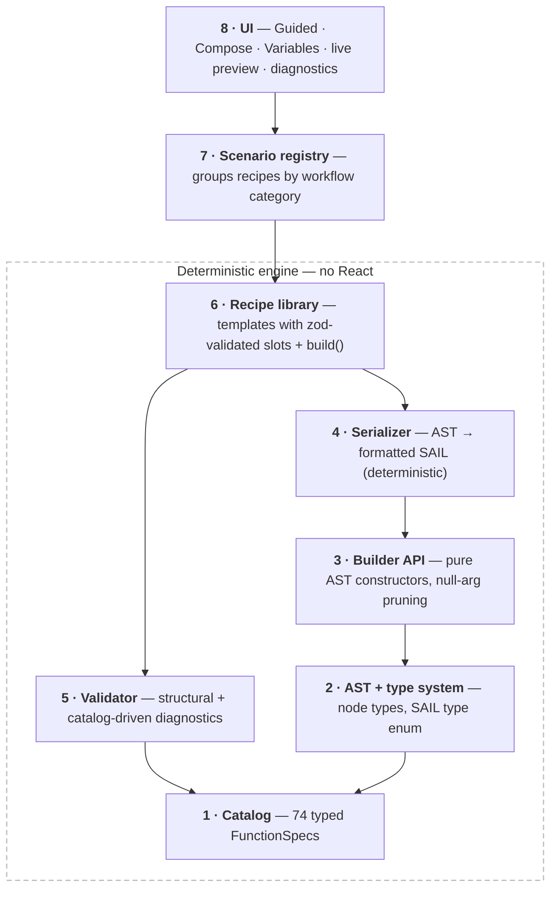

<div align="center">

# ⛵ SAIL Formula Generator

**Generate valid Appian SAIL expressions from guided forms and composable templates — no AI, no backend, works offline.**

[](https://github.com/creativeskyai/SAIL-Formula-Generator/actions/workflows/ci.yml)
[](LICENSE)

</div>

---

Pick a scenario, fill in a form, and copy correct, formatted SAIL. Same inputs always produce byte-identical output — the "intelligence" is a typed function catalog, a recipe library, and a small composition engine, not a model. It guarantees *syntactic* well-formedness and catalog conformance; it never guesses.

## Why it works without AI

SAIL is a functional language: every construct — components, layouts, queries, logic — is a documented function call with a known parameter list, types, and defaults (`a!textField(label:, value:, saveInto:, ...)`). There is no imperative control flow to infer, so the whole space maps onto three things a compiler front-end already handles:

- an **AST** — function calls, literals, arrays, maps, variable refs, operators,
- a **catalog** — each function is a schema of typed parameters, and
- a **serializer** — AST → formatted SAIL string.

This is a compiler problem, not an ML problem.

## The three modes

| Mode | What you do |
|------|-------------|
| **Guided** | Pick a scenario, fill a dynamic form, watch valid SAIL generate live, then copy or export. |
| **Compose** | Write free-form SAIL in an editor with catalog autocomplete, skeleton snippets, and live validation. |
| **Variables** | Declare `ri!` / `local!` variables with types; they feed autocomplete and resolve reference checks in both other modes. |

Everywhere you work:

- **Live preview and diagnostics** on every change, with one-click fixes — an unresolved `ri!`/`local!` reference offers a **Declare** button on every surface instead of making you switch tabs.
- **Paste your record-type reference once** and it prefills every scenario that uses one.
- **Presets** (saved locally, plus JSON export/import) and **session persistence** — reload and pick up where you left off.
- **A first-run tour** walks through the three modes once; reopen it anytime from the **?** button in the header. Copy the output anywhere with **Ctrl+Enter**.
- **Accessible by design** — full keyboard support, visible focus indicators (including inside the editors), WCAG AA contrast in light and dark themes down to syntax-highlight tokens, screen-reader announcements for copy and preset actions, and motion that respects `prefers-reduced-motion`.

## How it works

The deterministic engine (`src/core/` + `src/templates/`) has **zero UI dependencies**; the UI is a thin React shell on top.



| # | Layer | Module |
|---|-------|--------|
| 1 | Catalog | `src/core/catalog.ts` · `catalog.data.json` |
| 2 | AST + types | `src/core/ast.ts` · `types.ts` |
| 3 | Builder | `src/core/builder.ts` |
| 4 | Serializer | `src/core/serialize.ts` |
| 5 | Validator | `src/core/validate.ts` |
| 6 | Recipes | `src/core/recipe.ts` · `src/templates/` |
| 7 · 8 | Registry + UI | `src/templates/index.ts` · `src/ui/` |

Key correctness choices (full rationale in [`PLAN.md`](PLAN.md) §0): SAIL escapes embedded quotes by **doubling** them; `and` / `or` / `not` are **function calls**, not operators; the serializer emits no trailing commas; record references get their own AST node because they need re-linking in a real Appian environment.

## Quickstart

```bash
npm install
npm run dev      # start the app (Vite)
npm run build    # static production build in dist/
npm test         # run the test suite
```

The production build is plain static files with relative paths — serve `dist/` from any file server, subdirectory, or CDN (`npx serve dist`, nginx, S3, GitHub Pages…). No backend, no network calls.

Don't want to build? Grab the prebuilt static bundle from the [latest release](https://github.com/creativeskyai/SAIL-Formula-Generator/releases/latest) and serve the unzipped folder the same way.

## Limits

- **Syntactic, not semantic.** It cannot verify a given app's record types, fields, or security; record references usually need re-linking in Appian.
- **Coverage is finite by construction.** Templates cover the common cases; Compose mode covers the rest but expects SAIL knowledge.
- **Type checks are advisory** warnings, never guarantees.

## Stack

Vite · React 19 · TypeScript (strict) · Tailwind v4 · Zustand · CodeMirror 6 · Zod · Vitest — client-only, static build, fully offline (fonts self-hosted, no CDN).

## License

[Apache 2.0](LICENSE)
